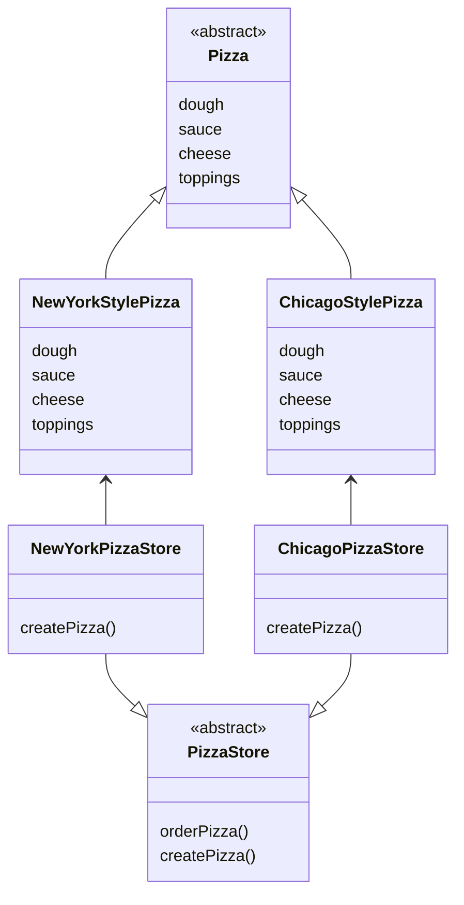
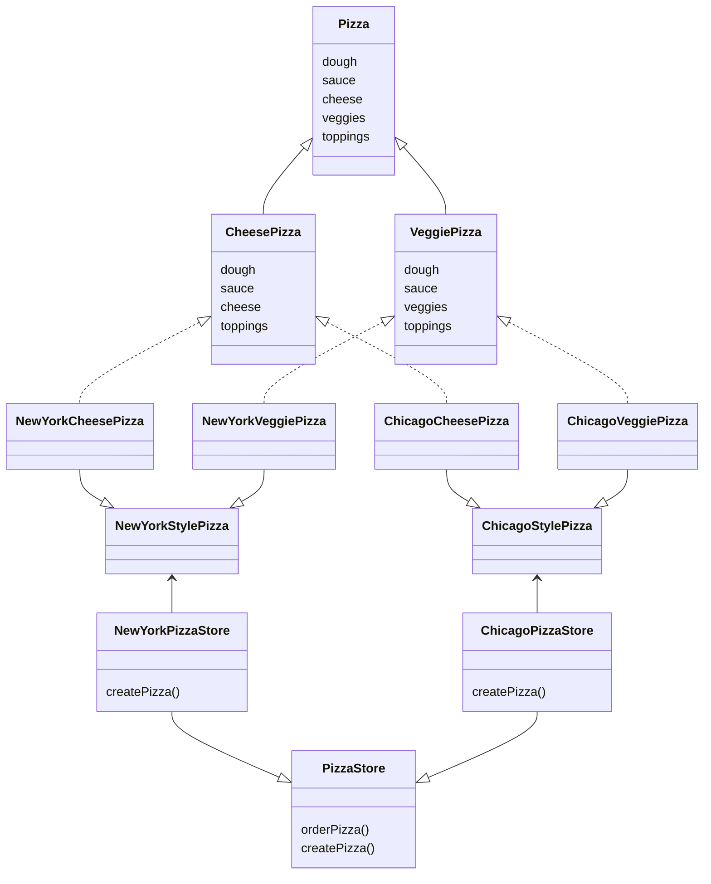
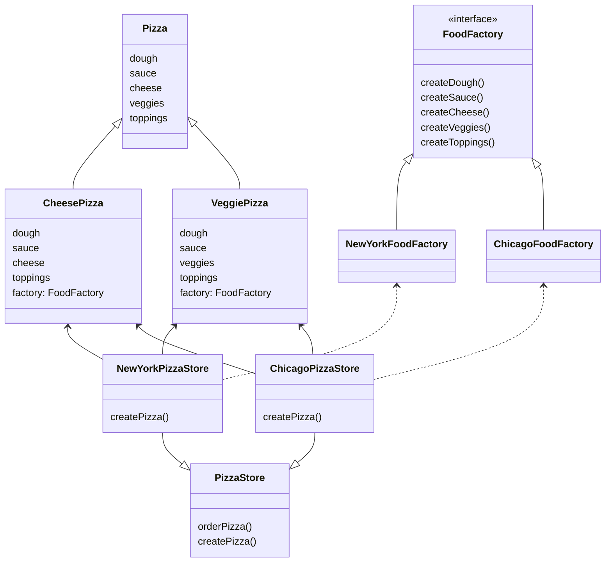
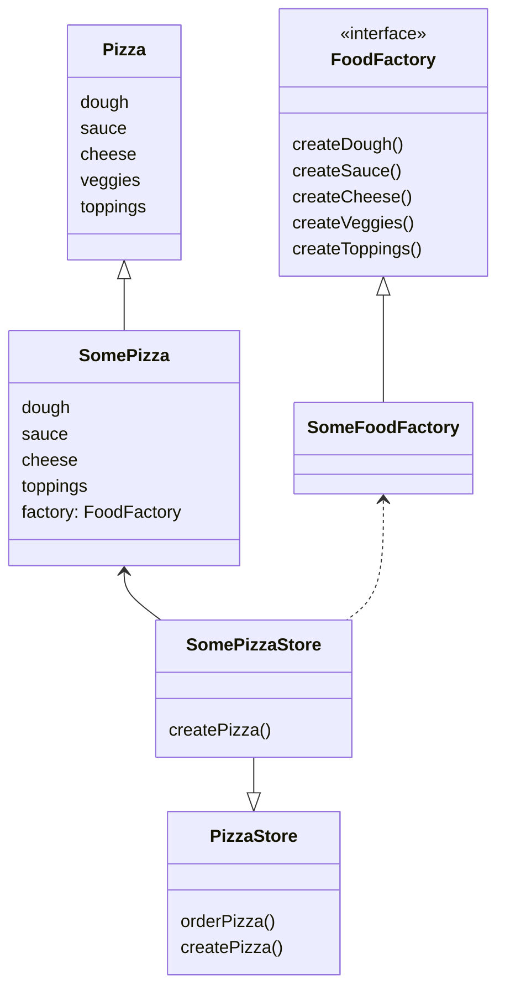

# Abstract Factory Pattern

## 정의

> 클래스에서 실제 구현부를 정의하지 않고 팩토리에 인터페이스를 생성하도록 요청하여 인스턴스를 가져온다.
>
> 따라서 인터페이스를 구현한 팩토리를 통해 서로 관련성이 있는 객체의 집합을 생성할 수 있다.

## 사례

[팩토리 메소드 패턴(Factory Method Pattern)](../factorymethod)의 사례에서 이어진다.

팩토리 메소드 패턴에서는 뉴욕 스타일의 피자(`NewYorkStylePizza`)와 시카고 스타일의 피자(`ChicagoStylePizza`)를
각 지역의 피자 가게(`NewYorkPizzaStore`, `ChicagoPizzaStore`)에서 피자의 구체적인 내용을 작성하고 만들었다.

## 이슈

이제는 `Pizza`에 채소(veggies)를 별도로 구분하여 관리하고자 한다.

문제는 치즈 피자(`CheesePizza`)에는 채소가 안 들어가고, 채소 피자(`VeggiePizza`)에는 치즈가 들어가지 않는다.

비슷한 방식으로 `Pizza`라는 추상적인 특징에는 있지만, 실제로 구현될 때마다 다르게 처리되어야하는 로직이 생기게 되었다.

게다가 같은 치즈 피자(`CheesePizza`)라고 하여도, 뉴욕(`NewYork`)과 시카고(`Chicago`)에서 사용하는 재료가 조금씩은 달랐다.
예를 들어, 뉴욕은 모짜렐라 치즈를 쓰지만 시카고에서는 모짜렐라 치즈에 파마산과 볼로네 치즈로 피자를 만든다.  

만약 팩토리 패턴으로 작성된 기존의 구조에서 위의 요구사항대로 확장한다면 아래와 같이 그릴 수 있다.

## 풀이

구현 클래스를 묶어서 어떤 피자(`SomePizza`)와 같이 하나로 보고 관계를 간단하게 그리면 아래와 같다.

어떤 피자(`SomePizza`)는 각 재료들이 어떻게 만들어지는 전혀 알 필요가 없어졌으니 토핑을 얹는 등의 피자 만들기에 집중할 수 있다.

어떤 피자 공장(`SomeFoodFactory`)은 각 재료를 어떻게 만드는지에만 집중한다.

어떤 피자 가게(`SomePizzaStore`)는 피자 레시피(`Pizza`)에 **필요한 재료만** 각 지역에 맞는 공장(`SomeFoodFactory`)에서 가져와 준비한다.

재료가 다 준비되었으면 도우 반죽과 피자 굽기 등으로 특정 피자(`SomePizza`)를 만들면 된다.