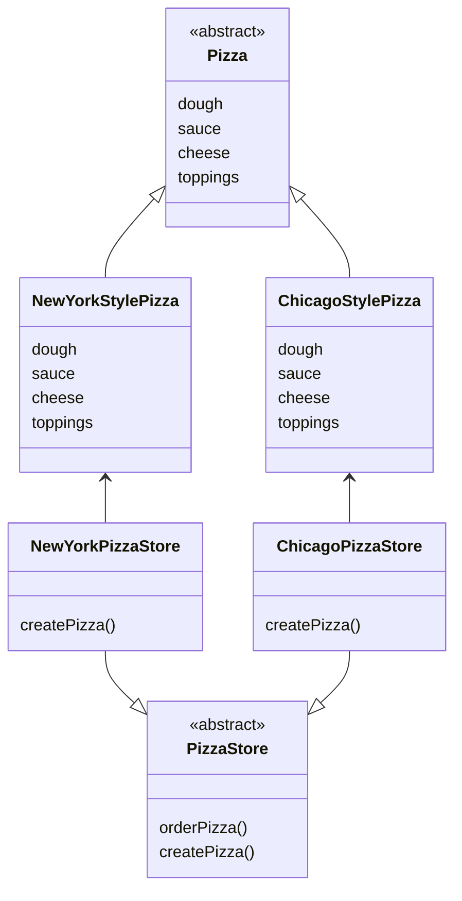
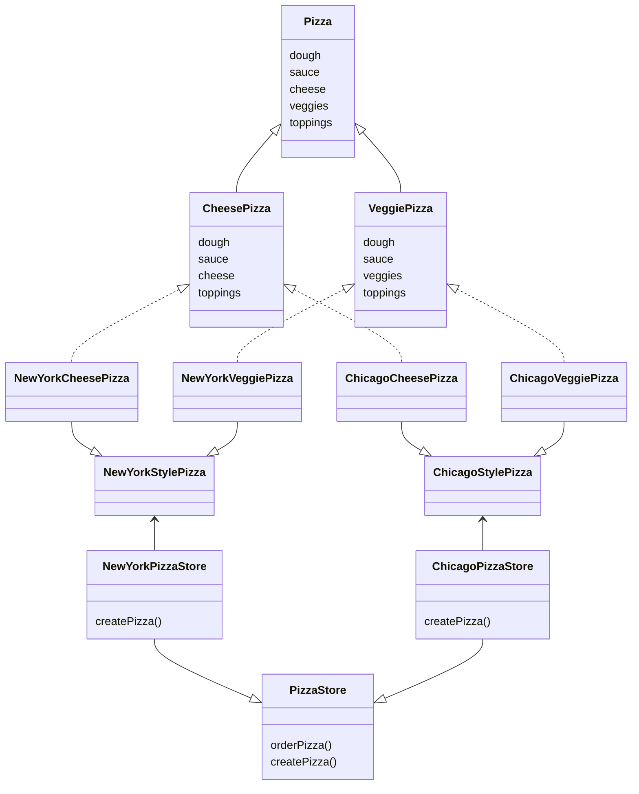
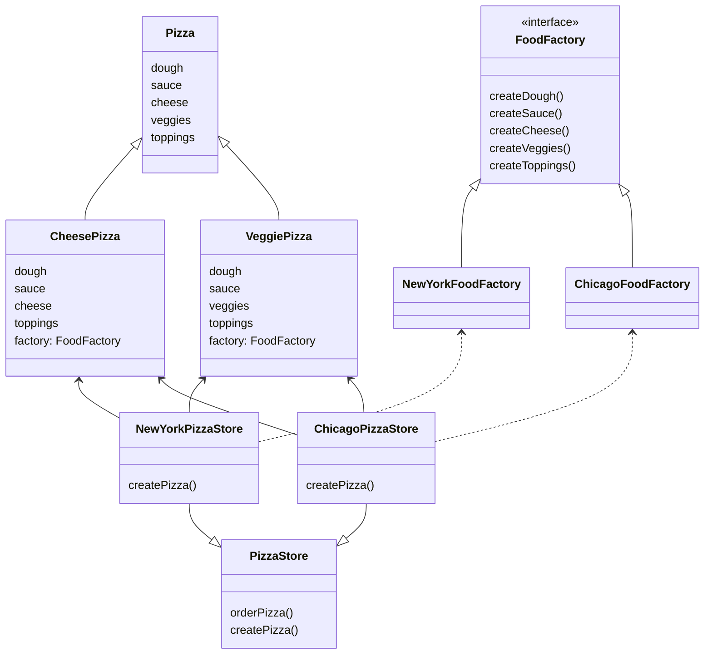
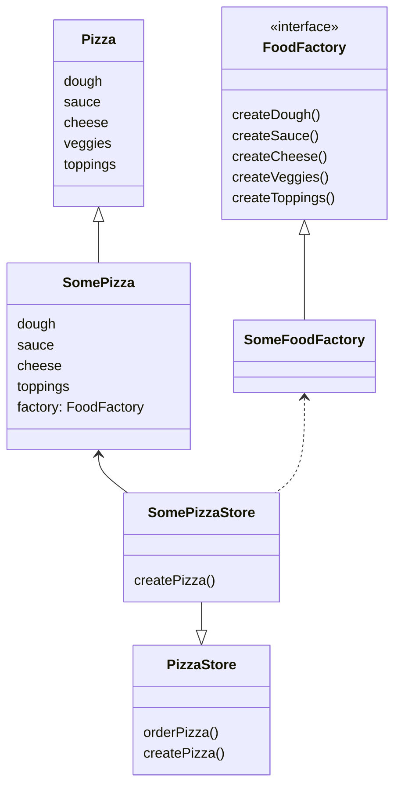

# Abstract Factory Pattern

## 정의

> 클래스에서 실제 구현부를 정의하지 않고 팩토리에 인터페이스를 생성하도록 요청하여 인스턴스를 가져온다.
>
> 따라서 인터페이스를 구현한 팩토리를 통해 서로 관련성이 있는 객체의 집합을 생성할 수 있다.

## 사례

[팩토리 메소드 패턴(Factory Method Pattern)](../factorymethod)의 사례에서 이어진다.

팩토리 메소드 패턴에서는 피자를 생성하는 역할은 함수(Method)로 다른 클래스에 위임하여 해결했다.

그리고 피자의 생성 방식은 각 지점인 `NewYorkPizzaStore`, `ChicagoPizzaStore`와 결정하도록 했다.

```java
class NewYorkPizzaStore extends PizzaStore {
    @Override
    protected Pizza createPizza(String type) {
        return switch (type) {
            case "cheese" -> new NewYorkCheesePizza();
            case "pepperoni" -> new NewYorkPepperoniPizza();
            default -> null;
        };
    }
}

class ChicagoPizzaStore extends PizzaStore {
    @Override
    protected Pizza createPizza(String type) {
        return switch (type) {
            case "cheese" -> new ChicagoCheesePizza();
            case "pepperoni" -> new ChicagoPepperoniPizza();
            default -> null;
        };
    }
}
```

다이어그램으로 보면 아래와 같다.



## 이슈

이제는 `Pizza`에 채소(veggies) 항목이 추가되었다.

문제는 치즈 피자(`CheesePizza`)에는 채소가 안 들어가고, 채소 피자(`VeggiePizza`)에는 치즈가 들어가지 않는다.

비슷한 방식으로 `Pizza`라는 추상적인 특징에는 있지만, 실제로 구현될 때마다 다르게 처리되어야하는 로직이 생기게 되었다.

게다가 같은 치즈 피자(`CheesePizza`)라고 하여도, 뉴욕(`NewYork`)과 시카고(`Chicago`)에서 사용하는 재료가 조금씩은 달랐다.
예를 들어, 뉴욕은 모짜렐라 치즈를 쓰지만 시카고에서는 모짜렐라 치즈에 파마산과 볼로네 치즈로 피자를 만든다.  

만약 팩토리 패턴으로 작성된 기존의 구조에서 위의 요구사항대로 확장한다면 아래와 같이 그릴 수 있다.



## 풀이

`Pizza`의 각 요소(`dough`, `cheese`, `toppings`, ...)를 생성하는 별도의 팩토리를 정의하고,

`PizzaStore`에서는 이 요소들을 사용해 `Pizza`를 생성하도록 만듭니다.

이제 역할은 아래와 같이 분리된다.

- `FoodFactory`: 각 재료별(`dough`, `cheese`, `toppings`)로 생성 방식을 결정
- `FoodStore`: 메뉴에 따라 레시피(`CheesePizza`)만 보고 `Pizza`를 생성
- `CheesePizza`: 어떤 재료가 사용되는 지, 필요한 재료만 합성 (예로 들면 `veggie`는 사용 안 함)

`FoodFactory`는 어떤 피자가 만들어질 것인지는 알 필요가 없고 각 재료를 만드는 것만 집중하면 된다.

그리고 `CheesePizza`는 하나의 레시피가 되어서, 어떤 재료를 사용할 것인지만 정의한다.

```java
class CheesePizza extends Pizza {

    FoodFactory factory;

    public CheesePizza(FoodFactory factory) {
        this.factory = factory;
    }

    @Override
    public void prepare() {
        // 채소(veggie)는 사용하지 않는다. 
        dough = factory.createDough();
        sauce = factory.createSauce();
        cheese = factory.createCheese();
        toppings.addAll(factory.createToppings());
    }
}
```


다이어그램과 함께 아래의 코드를 살펴보는 것을 추천한다.



구현 클래스를 묶어서 어떤 피자(`SomePizza`)와 같이 하나로 보고 관계를 간단하게 그리면 아래와 같다.



어떤 피자(`SomePizza`)는 각 재료들이 어떻게 만들어지는 전혀 알 필요가 없어졌으니 토핑을 얹는 등의 피자 만들기에 집중할 수 있다.

어떤 피자 공장(`SomeFoodFactory`)은 각 재료를 어떻게 만드는지에만 집중한다.

어떤 피자 가게(`SomePizzaStore`)는 피자 레시피(`Pizza`)에 **필요한 재료만** 각 지역에 맞는 공장(`SomeFoodFactory`)에서 가져와 준비한다.

재료가 다 준비되었으면 도우 반죽과 피자 굽기 등으로 특정 피자(`SomePizza`)를 만들면 된다.

## 코드

예시로 `ChicagoPizzaStore`는 아래와 같이 변경되었다.

```java
class ChicagoPizzaStore extends PizzaStore {

    @Override
    protected Pizza createPizza(String type) {
        FoodFactory factory = new ChicagoFoodFactory();
        return switch (type) {
            case "cheese" -> {
                Pizza pizza = new CheesePizza(factory);
                pizza.setName("Chicago Style Cheese Pizza");
                yield pizza;
            }
            case "pepperoni" -> {
                Pizza pizza = new PepperoniPizza(factory);
                pizza.setName("Chicago Style Pepperoni Pizza");
                yield pizza;
            }
            case "veggies" -> {
                Pizza pizza = new VeggiePizza(factory);
                pizza.setName("Chicago Style Veggie Pizza");
                yield pizza;
            }
            default -> null;
        };
    }
}

class ChicagoFoodFactory implements FoodFactory {
    @Override
    public String createDough() {
        return "Thick deep-dish and buttery dough";
    }

    @Override
    public String createSauce() {
        return "Thin and tangy sauce";
    }

    @Override
    public String createCheese() {
        return "Mozzarella cheese";
    }

    @Override
    public String createVeggies() {
        return "Eggplant, jalapenos";
    }

    @Override
    public List<String> createToppings() {
        return List.of("pepperoni", "sausage", "mushrooms", "onions", "peppers", "olives");
    }
}
```