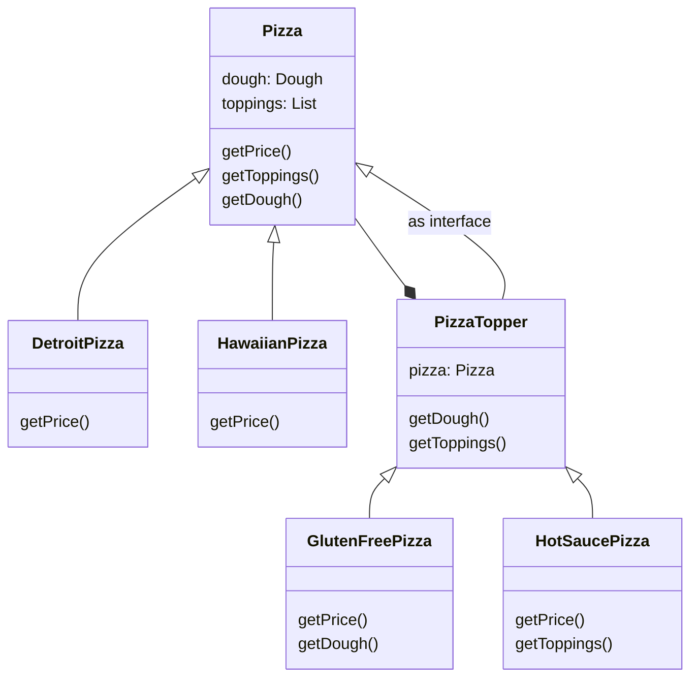

# Decorator Pattern

```mermaid
classDiagram
    class Pizza {
	    dough: Dough
	    toppings: List<String>
	    getPrice()
	    getToppings()
	    getDough()
    }
	class DetroitPizza {
		getPrice()
	}
	class HawaiianPizza{
		getPrice()
	}
	class PizzaTopper {
		pizza: Pizza
	    getDough()
	    getToppings()
	}
	class GlutenFreePizza {
		getPrice()
		getDough()
	}
	class HotSaucePizza {
		getPrice()
		getToppings()
	}
	Pizza <|-- DetroitPizza
	Pizza <|-- HawaiianPizza
	Pizza --* PizzaTopper
	Pizza <|-- PizzaTopper: as interface
	PizzaTopper <|-- GlutenFreePizza
	PizzaTopper <|-- HotSaucePizza
```