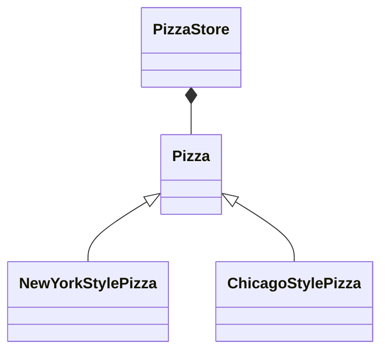
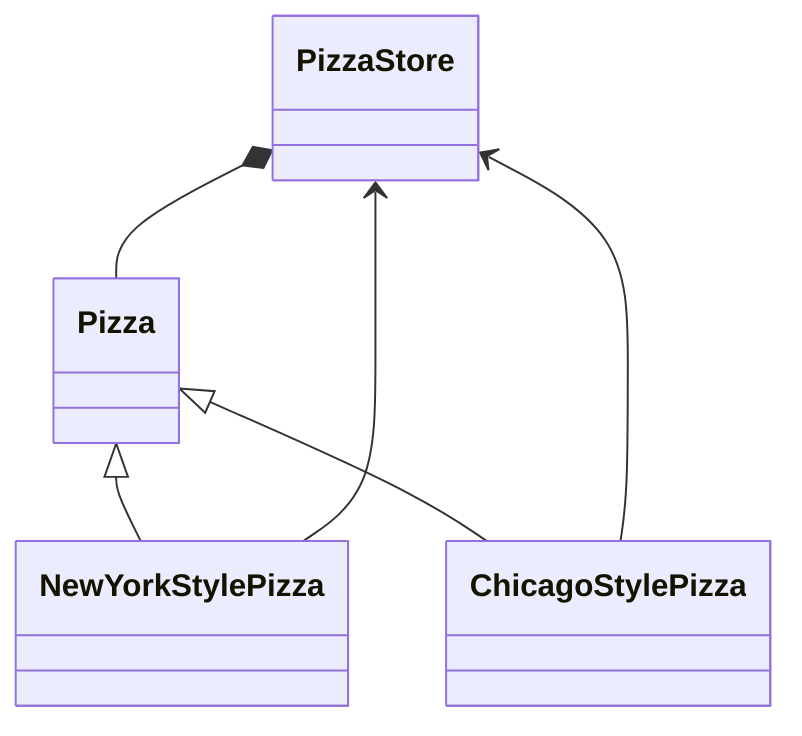
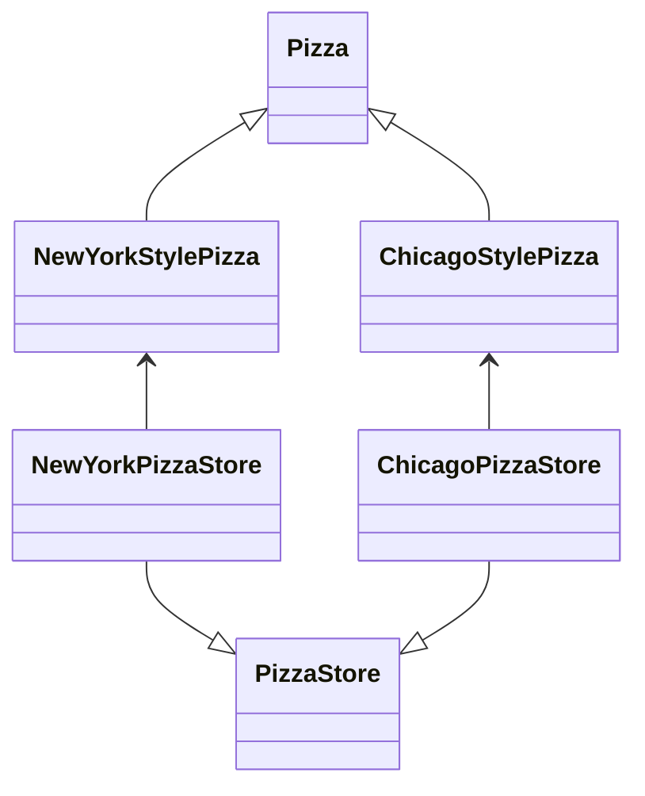

# Factory Method Pattern

## 정의

> 객체를 생성할 때, 특정 구현 클래스를 사용해서 만드는 것이 아니라 필요한 인터페이스로부터 만든다.
> 
> 어떤 클래스의 인스턴스를 만들지는 서브 클래스에서 결정한다.
 
## 사례

피자 가게(`PizzaStore`) 클래스는 피자(`Pizza`)를 만들어서 굽고(`bake()`) 자르고(`cut()`) 판매를 준비한다.

가게에서 만드는 피자 종류는 아래와 같이 2종류이다.

- `NewYorkStylePizza` : 뉴욕 스타일의 피자
- `ChicagoStylePizza` : 시카고 스타일의 피자

그래서 다이어그램은 다음과 같았다.



## 이슈

하지만 코드를 구현하다보니, 피자 가게(`PizzaStore`)에서 피자를 만들려면 피자의 서브클래스를 직접 사용할 수 밖에 없었다.

```java
class PizzaStore {
    public Pizza orderPizza(String menu) {
        return switch (menu) {
            case "newyork" -> new NewYorkStylePizza();
            case "chicago" -> new ChicagoStylePizza();
            default -> null;
        };
    }
}
```

이런 방식이면 의도와 달리 `PizzaStore`는 `NewYorkStylePizza`와 `ChicagoStylePizza`에 의존성이 생긴다.



## 풀이


