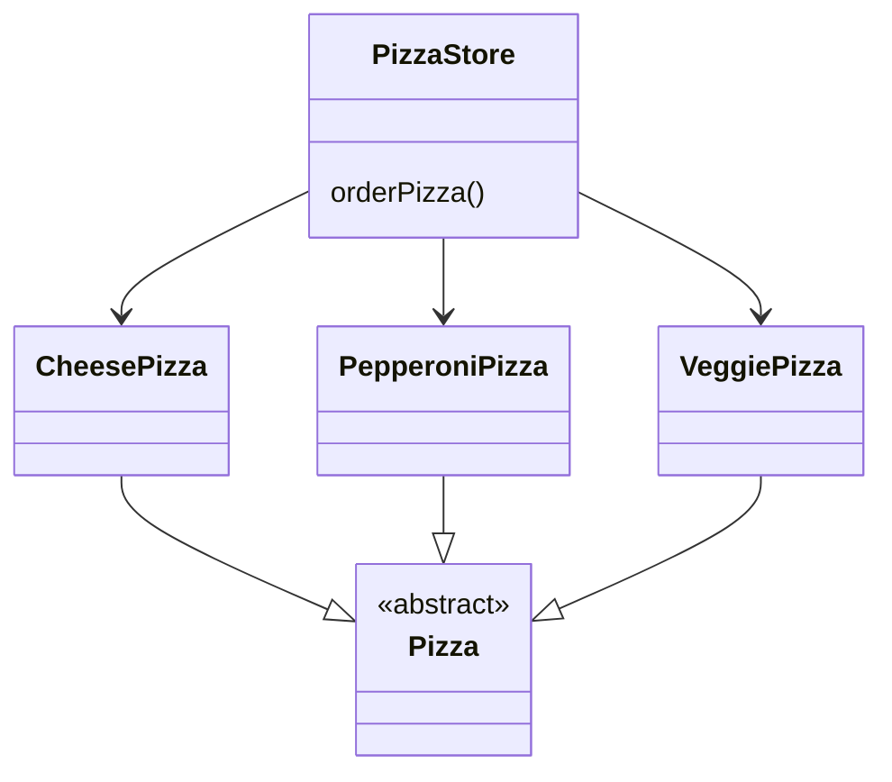
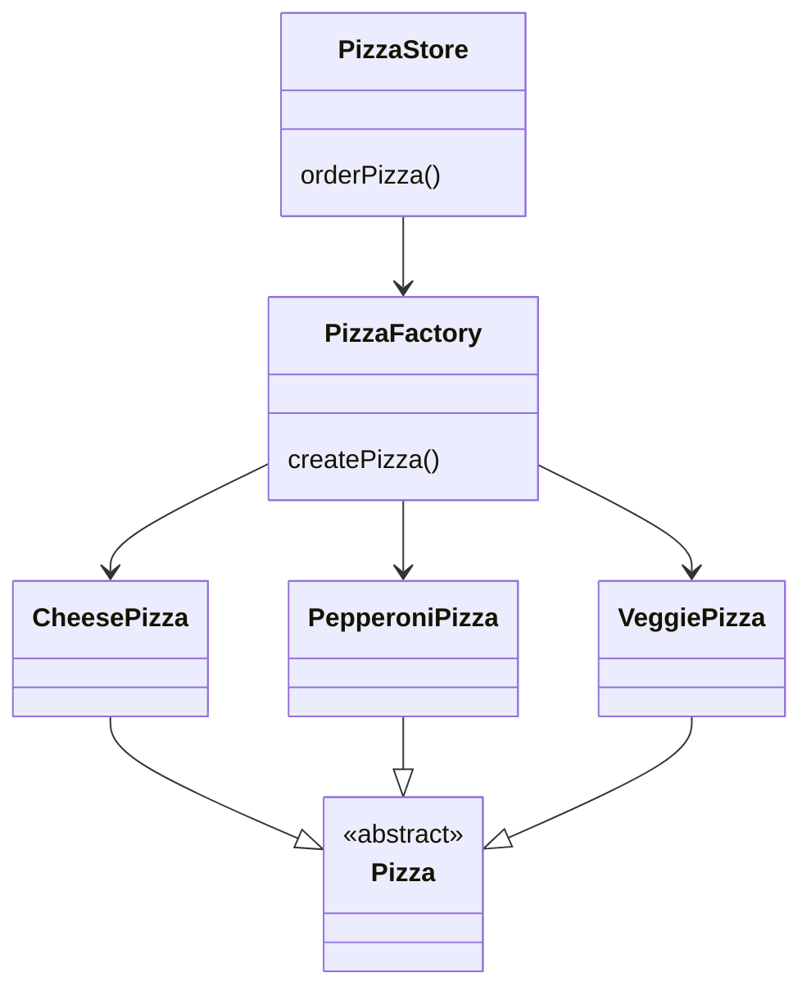

# Factory Method Pattern

## 정의

> 객체를 생성할 때, 특정 구현 클래스를 사용해서 만드는 것이 아니라 필요한 인터페이스로부터 만든다.
> 
> 어떤 클래스의 인스턴스를 만들지는 서브 클래스에서 결정한다.
 
## 사례

피자 가게(`PizzaStore`) 클래스는 피자(`Pizza`)를 만들어서 굽고(`bake()`) 자르고(`cut()`) 판매를 준비한다.

가게에서 만드는 피자 종류는 아래와 같이 2종류이다.

- `CheesePizza`
- `PepperoniPizza`

그래서 `PizzaStore`에서는 피자가 주문되는 로직을 다음과 같이 구현했었다.

```java
class PizzaStore {
    Pizza orderPizza(String menu) {
        Pizza pizza;
        
        if (menu.equals("cheese")) {
            pizza = new CheesePizza();
        } else if (menu.equals("pepperoni")) {
            pizza = new PepperoniPizza();
        } else if (menu.equals("veggie")) {
            pizza = new VeggiePizza();
        }
        
        pizza.cook();
        pizza.cut();
        return pizza;
    }
}
```

## 이슈

어느 날 피자 가게는 채식주의자를 위한 채소 피자(`VeggiePizza`)를 메뉴에 추가하기로 했다.

`PizzaStore`의 `orderPizza()` 함수에 아래와 같이 변경하기로 했다.

```diff
Pizza orderPizza(String menu) {
    ...
    if (menu.equals("cheese")) {
        pizza = new CheesePizza();
    } else if (menu.equals("pepperoni")) {
        pizza = new PepperoniPizza();
+   } else if (menu.equals("veggie")) {
+       pizza = new VeggiePizza();
    }
    ...
 }
```

기존의 메뉴가 삭제되어서 주문할 수 없거나, 새로운 메뉴가 추가될 때 마다 `orderPizza()` 함수를 수정하게 생겼다.

새로 추가되는 `Pizza`와 상관 없이, `PizzaStore`의 **나머지 부분은 전부 동일한데 클래스를 수정**해야하는 뜻이다.

## 풀이

지금까지의 다이어그램을 살펴보자. `orderPizza()` 에서 각 구현 클래스들에 의존하고 있기 때문에 아래와 같이 그릴 수 있다. 



먼저 피자가 생성되는 부분을 분리한다. 그리고 이것을 `Factory`라고 부르자.



즉, 생성되는 부분을 `Factory` 클래스로 역할을 위임하는 것이다. 코드로는 다음과 같이 바꿀 수 있다.

```java
class PizzaStore {
    PizzaFactory factory;
    
    Pizza orderPizza(String menu) {
        Pizza pizza = factory.createPizza(menu);
        pizza.cook();
        pizza.cut();
        return pizza;
    }
}

class PizzaFactory {
    Pizza createPizza(String menu) {
        if (menu.equals("cheese")) {
            return new CheesePizza();
        } else if (menu.equals("pepperoni")) {
            return new PepperoniPizza();
        } else if (menu.equals("veggie")) {
            return new VeggiePizza();
        }
        return null;
    }
}
```

이제는 `PizzaStore`의 `Pizza` 생성을 제외한 **나머지 부분이 전부 동일한 데 불구하고 클래스를 수정**해야하는 일은 사라졌다.

앞으로는 메뉴에 변경이 생길 때 `PizzaFactory` 클래스만 변경하면 되기 때문이다.

팩토리 클래스를 만들었는데 이름이 "팩토리 메서드 패턴"인 이유는, 무늬만 클래스일 뿐이지 실제로는 함수(method)를 추상화했기 때문이다.

헷갈린다면 아래의 방법도 살펴보자.

## 다른 풀이

앞선 풀이에서는 팩토리를 구성(Composition) 관계로 작성했는데, 상속으로 작성이 가능하다.

`PizzaStore`의 생성 부분을 클래스가 아닌 구현해야하는 인터페이스로 만들어서 하위 클래스에서 결정하도록 하면 된다.

```java
class abstract PizzaStore {
    Pizza orderPizza(String menu) {
        Pizza pizza = createPizza(menu);
        pizza.cook();
        pizza.cut();
        return pizza;
    }
    
    abstract Pizza createPizza(String menu); 
}
    
class MyPizzaStore {
    @Override
    Pizza createPizza(String menu) {
        if (menu.equals("cheese")) {
            return new CheesePizza();
        } else if (menu.equals("pepperoni")) {
            return new PepperoniPizza();
        } else if (menu.equals("veggie")) {
            return new VeggiePizza();
        }
        return null;
    }
}
```

## 코드

이 repository의 코드에서는 상속 방식을 사용했고, 더 많은 피자 가게(`PizzaStore`)를 만들었다.

- `NewYorkPizzaStore` : 뉴욕 지점 피자 가게
- `ChicagoPizzaStore` : 시카고 지점 피자 가게

그리고 아래와 같이 각 지점마다 어떤 피자를 만들 지 결정하고 있다.

```java
class NewYorkPizzaStore extends PizzaStore {
    @Override
    protected Pizza createPizza(String type) {
        return switch (type) {
            case "cheese" -> new NewYorkCheesePizza();
            case "pepperoni" -> new NewYorkPepperoniPizza();
            default -> null;
        };
    }
}
```