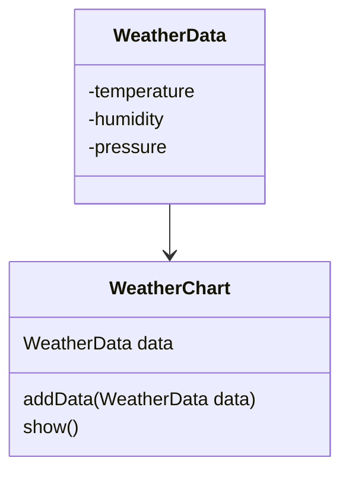
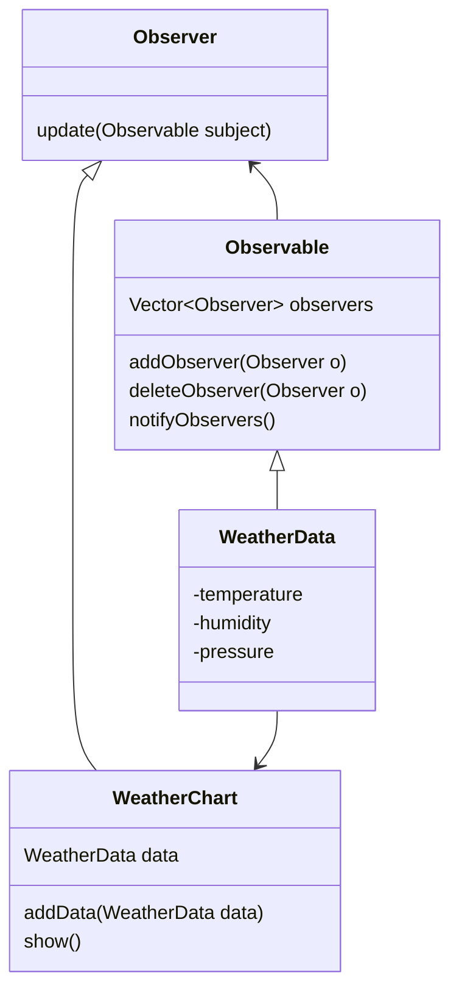

# Observer Pattern

## 정의

> 객체를 관찰 대상으로 두고, 어떤 객체가 그 객체를 관찰하도록 만든다.
>
> 그리고 대상 객체에 상태 변화가 있을 때마다 함수 등을 통해서
>
> 상태에 변화가 있었음을 통지하도록 하는 디자인 패턴이다.

여기서 관찰 대상인 객체는 이벤트를 발생시키는 (자신의 변화를 통보하는) 주체라는 의미에서 `Subject`,

그런 `Subject`를 관찰을 하는 객체를 `Observer`라 표현한다.

일상에서 가장 대표적인 예는 유튜브 채널(`Subject`)과 구독자(`Observer`) 사이의 알림 메시지가 있다.

## 사례

기상 관측소에서는 일정 주기로 관측한 날씨를 기록해왔다.

최근에는 기온과 습도, 기압을 측정할 수 있는 최신식 관측기를 새로 설치하였다.

관측기는 날씨 변화가 있을때마다 저장된 관측 결과(`WeatherData`)가 바뀌는데,

**1분마다** 관측기에서 관측 결과를 확인하여 차트에 결과를 추가하고 있다.



```java
WeatherData data = new WeatherData();
WeatherChart chart = new WeatherChart();
for every 1 minutes {
    // 1분마다 서버에서 관측 결과를 가져온다.
    data.setValue(server.download());
    // 차트에 결과 추가
    chart.addData(data);
}
```

## 이슈

하지만 문제가 생겼다. 매월 말 접속 기록에서 관측 결과를 확인한 횟수마다 1원의 요금을 지불해야하는 정책이 생겼다.

지금의 방식대로라면 기온/습도/기압에 아무 변화가 없더라도 1분마다 1원씩을 지불해야하게 된다. _(계산해보자면 한 달에 약 45,000원)_

그래서 관측 결과에 변화가 생길때만 그 결과를 받아오고 싶다.

## 적용

차트(`WeatherChart`)는 관측 결과(`WeatherData`)를 관찰(Observe)하고 싶다. 즉, `WeatherData`에 변화가 생겼을 때 그 이벤트를 알고
싶다.

`WeatherData`는 상태 변경을 알려줄 관찰자(Observer)들을 알고 있게 만들고, `setValue(...)`가 호출될 때 마다 관찰자들에게 이를 알릴 수 있다.



> 참고로 자바에는 `Observer`, `Observable` 과 같은 클래스/인터페이스가 내장 패키지에 존재한다.
>
> Java 9 이후 버전부터는 Deprecated 처리되었지만, 아직은 사용할 수 있다.

이제 `WeatherData`는 주체(Subject)가 되어서 값이 변경될 때 모든 옵저버(Observer)들에게 변경되었음을 알린다. (`notifyObservers()`)

```diff
+ class Observable {
+    protected Vector<Observer> observers;
+
+    void notifyObservers() {
+        for (Observer observer : observers) {
+            observer.update(this);
+        }
+    }
+ }

-class WeatherData {
+class WeatherData extends Observable {
    private float temperature;
    
    void setValue(...) {
        this.temperature = ...
+       notifyObservers();
    }
}
```

`WeatherData`는 주체(Subject)가 되고, `WeatherChart`는 옵저버(Observer)로서 `WeatherData`를 다음과 같이 관찰하도록 만든다.

```java
weatherData.addObserver(chart);
```

이제 자신이 관찰하고 있는 주체(Subject)로부터 어떤 알림이 오면 `update(...)` 함수가 실행된다.

```java
public class WeatherChart implements Observer {

    private final List<Float> temperatures = new ArrayList<>();

    @Override
    public void update(Observable o, Object arg) {
        // 어느 Subject에서 온 호출인지에 따라 적절하게 행동
        if (o instanceof WeatherData weatherData) {
            temperatures.add(weatherData.temperature);
        }
    }
}
```

## 읽을 거리

라이브러리에서 자주 볼 수 있는 관용적인 표현으로 리스너(`Listener`)가 있는데,
이것을 정확히 **옵저버 패턴**이라기보다는 그 활용 사례 중 하나인 것으로 보는 게 맞다고 한다.

리스너는 보통 콜백(`Callback`)으로 자주 사용되는 데, 옵저버 패턴에서는 `Subject`와 `Observer`는 매우 추상적인 수준에서
서로 독립적이다.

하지만 리스너는 대개 인터페이스가 아니라 **이미 구현된 클래스**에 붙기 때문에 완전한 옵저버 패턴이라고 부르지는 않는 의견이 많다.

이 내용에 대해서 관심있다면 아래 링크를 참고하면 좋다.

- [Observer Design Pattern vs "Listeners"](https://stackoverflow.com/questions/3358622/observer-design-pattern-vs-listeners)
- [What's the difference between Observer pattern and listeners?](https://softwareengineering.stackexchange.com/questions/378748/whats-the-difference-between-observer-pattern-and-listeners)
