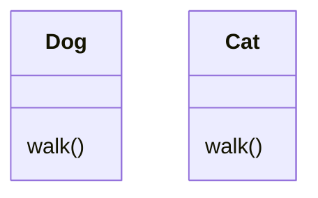
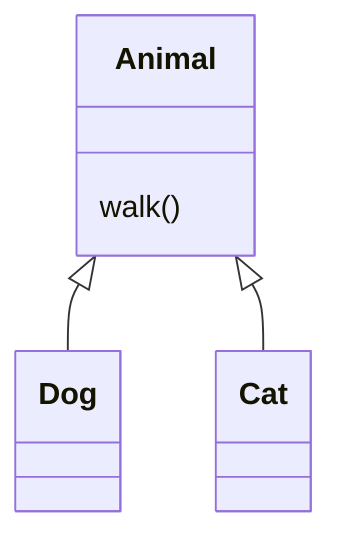
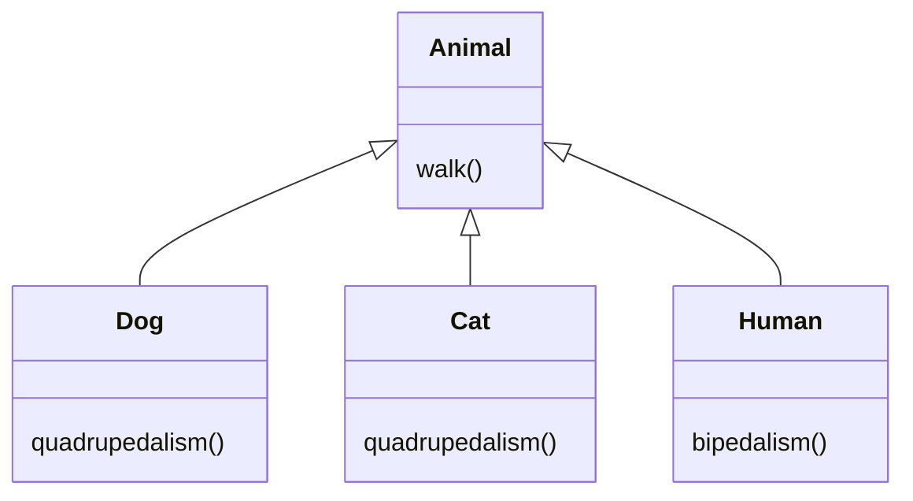
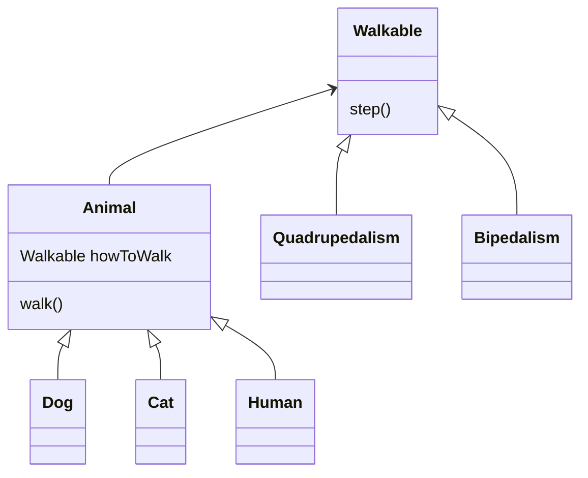

# 전략 패턴(Strategy Pattern)

## 정의

> 알고리즘을 캡슐화하고 교체 가능하도록 만들어서,
>
> 클라이언트 사용하는 것과는 별개로 변경될 수 있도록 하는 패턴

## 상황

지구에 사는 동물들의 움직임을 예측하고자 시뮬레이션 프로그램을 작성하려고 한다.

**개**와 **고양이** 클래스가 다음과 같이 먼저 구현되어 있다.



개와 고양이 모두 걷는 기능 `walk()`에 중복이 있어서 상속을 통해 아래와 같이 해결하였다.



## 문제

기존의 `walk()` 함수는 **네 발로 걷는 동작**으로 구현되어 있다.

하지만 사람(`Human`)도 동물이지만 개와 고양이와는 걷는 방법이 달라서 같은 함수를 호출할 수 없다.

이대로면 앞으로도 네 발로 걷지 않는 모든 동물들의 클래스의 `walk()`를 오버라이딩해야한다.

## 풀이

먼저 상속이 아니라 인터페이스로 바꾸어서 조금씩 해결해보자.

사족보행(quadrupedalism) 함수와 이족보행(bipedalism) 함수를 하위 클래스에 두고 이를 사용한다.



그리고 다음과 같이 **인터페이스에 맞춰서** 구현한다.

```java
class Dog {
    @Override
    void walk() {
        quadrupedalism();
    }
}
class Human {
    @Override
    void walk() {
        bipedalism();
    }
}
```

이제는 어떤 동물이건 상관없이 같은 방법으로 걷는 기능을 사용할 수 있다.

```java
Animal dog = new Dog();
dog.walk();

Animal human = new Human();
human.walk();
```

모든 사족보행을 하는 동물마다 **같은 사족보행 코드를 오버라이딩 해야한다는 문제점**이 아직 남아있다.

걷는다는 **행동**을 구현하고자 하는 클래스에서 정의한 함수를 쓰는 것이 아닌, **다른 클래스로 그 책임을 위임**하자.

그리고 책임을 넘긴 클래스를 하나의 **구성(Composition)** 요소로 사용해서 그 기능을 사용하자.



이제는 `Dog`, `Cat`, `Human` 클래스에서 더 이상 걷는 방법을 정의할 필요가 없다.

그리고 하위 클래스에서 함수 오버라이딩을 해야하는 불필요함도 사라졌다.

```java
class Animal {
    Walkable howToWalk;
    public void walk() {
        howToWalk.step();
    }
}

class Dog {
    public Dog() {
        howToWalk = new Quadrupedalism();
    }
}

class Cat {
    public Cat() {
        howToWalk = new Quadrupedalism();
    }
}

class Human {

    public Human() {
        howToWalk = new Bipedalism();
    }
}
```

하지만 사람도 걸음마를 배우기 전까지는 네 발로 걷다가, 어느 순간부터 두 발로 걷을 수 있다.

즉, 인스턴스 생성 이후에 실행될 함수가 변경될 수 있도록 고려해야한다.

우리는 이미 행동 클래스를 별도로 위임했으므로 이는 쉽게 해결할 수 있다.

```java
class Animal {

    Walkable howToWalk;

    public void setWalkingWay(Walkable howToWalk) {
        this.howToWalk = howToWalk;
    }

    public void walk() {
        howToWalk.step();
    }
}

Animal human = new Human();

// 최초에는 사족보행
human.setWalkingWay(new Quadrupedalism());
human.walk();

// 언제든 이족보행으로 변경 가능
human.setWalkingWay(new Bipedalism());
human.walk();
```

앞으로 소리를 내는 방식 등 행동에 대해 새롭게 추가하게 될 경우, 같은 방식으로 유연하게 대처할 수 있다.
